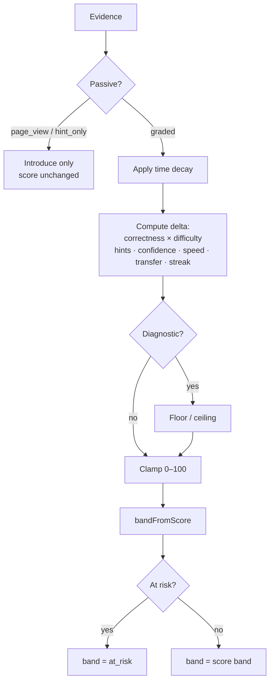

# LEARNING_ENGINE — DámMaturu.cz

> Mastery Engine specifikace (D-031). Stav k 2026-07-20.

## 0. Co tento dokument **neslibuje**

**Mastery score a agregát připravenosti nejsou statistická pravděpodobnost složení maturity.**

Nemáme validační dataset (výsledky maturit × historie attemptů), takže **nepublikujeme P(pass)**, „šanci na maturitu“ ani kalibrovaný percentil vůči populaci. UI smí ukazovat:

- mastery 0–100 per KnowledgeUnit,
- band (Not seen … At risk),
- vážený **mastery aggregate** jako souhrn pokrytí učiva,

vždy s jasným označením, že jde o **model opakování a evidence**, ne o predikci výsledku zkoušky.

---

## 1. Účel

Learning engine je **deterministické jádro**, které:

- měří mastery per KnowledgeUnit (0–100 + band),
- plánuje dnešní misi,
- řídí spaced repetition (SM-2 v1),
- počítá **mastery aggregate** (ne P(pass)),
- vrací chyby do fronty.

Není to LLM. LLM smí pomáhat jen při tvorbě obsahu **mimo** runtime rozhodování o mastery.

Implementace: `src/domain/learning/mastery-engine.ts` (+ legacy lesson bridge v `mastery.ts`).

---

## 2. Základní entity

### KnowledgeUnit (KU)

Nejmenší učitelná znalost.

### Evidence (MasteryEvidence)

Jeden signál o KU. Typy:

| Kind | Graded? | Smí zvednout score? |
|------|---------|---------------------|
| `page_view` | ne | **ne** |
| `hint_only` | ne | **ne** |
| `diagnostic` | ano | ano (+ floor/ceiling) |
| `practice` | ano | ano |
| `review` | ano | ano |
| `transfer` | ano | ano (+ bonus/penalta) |
| `speed` | ano | ano (+ speed adj., pokud `speedRelevant`) |
| `self_grade` | ano | ano |

Pole evidence: `correctness`, `difficulty` (1–5), `hintsUsed`, `selfConfidence` (1–5), `responseMs` / `expectedMs`, `speedRelevant`, `isTransfer`, `at`.

### MasteryState (per user × KU)

- `score` ∈ [0, 100]
- `band` — viz §3
- `evidenceCount`, `correctStreak`, `lapses`
- `successfulRecalls`, `transferSuccesses`, `diagnosticAttempts`
- `introducedAt`, `lastEvidenceAt`, `lastSuccessfulRecallAt`
- `peakBand` — nejvyšší dosažený non-risk band (pro At risk)

---

## 3. Bandystavy

| Band | Význam | Typická podmínka |
|------|--------|------------------|
| **Not seen** | žádná interakce | `introducedAt = null`, `evidenceCount = 0` |
| **Introduced** | viděno / otevřeno, málo nebo žádná graded evidence | score &lt; 15, už introduced |
| **Learning** | aktivní nácvik | score 15–39 |
| **Familiar** | opakovaně správně, ještě křehké | score 40–59 |
| **Strong** | stabilní recall | score 60–79, nebo ≥80 bez mastered gates |
| **Mastered** | vysoké score + evidence gates | score ≥ 80 **a** `evidenceCount ≥ 5` **a** `successfulRecalls ≥ 3` **a** (`correctStreak ≥ 3` ∨ `transferSuccesses ≥ 1`) |
| **At risk** | overlay | dříve peak ≥ Familiar (nebo score ≥ 40) **a** (tvrdý lapse ze Strong- **nebo** ≥14 dní bez úspěšného recall) |

**At risk** přepisuje zobrazovaný band; `peakBand` se nemaže (po úspěšném review se student vrací podle score).

---

## 4. Algoritmus aktualizace

Funkce: `applyMasteryEvidence(prev, evidence, knowledgeUnitId?)`.

### 4.1 Hard rule — pasivní signály

`page_view` a `hint_only`:

1. Pokud `not_seen` → `introduced`, `introducedAt = now`.
2. **Score se nemění** (delta = 0).
3. Otevření stránky / scroll / „continue“ **nikdy** nezvedá mastery.

Stejné pravidlo platí pro legacy lesson interakce `continue` / `back` / `save` / `open_explanation` / `understand` / `lesson_completed` (mapují se na passive evidence).

### 4.2 Decay před novou evidence

Pokud `score ≥ Familiar` a od `lastSuccessfulRecallAt` (jinak `lastEvidenceAt`) uplynulo víc než **7 dní**:

\[
\text{decay} = \min(18,\ (\text{days} - 7) \times 0.9)
\]

Score klesne o decay. Pak se přepočítá band (může vzniknout **At risk**).

### 4.3 Graded delta

Základ:

| Correctness | Base |
|-------------|------|
| correct | +8 |
| partial | +3 |
| incorrect | −12 |

**Obtížnost** (`difficulty` 1–5): tvrdé správné = větší zisk; tvrdé špatné = větší ztráta  
(`multiplier ≈ 1 + (difficulty−3)×0.12`, upraveno podle správnosti).

**Nápovědy:** při success (`correct`/`partial`) −1.5 × `hintsUsed`.

**Self-confidence:**

- overconfident miss (`confidence ≥ 4` ∧ incorrect) → −3
- underconfident hit (`confidence ≤ 2` ∧ correct) → +1

**Rychlost** (jen `speedRelevant`):

- velmi rychlé správné (`responseMs ≤ 0.55 × expectedMs`) → +1.5
- velmi pomalé správné (`responseMs ≥ 2.8 × expectedMs`) → −1.5

**Transfer** (`kind=transfer` nebo `isTransfer`):

- correct → +4 (a `transferSuccesses++`)
- incorrect → −6

**Opakované správné vybavení:** od 2. hit ve streaku +0.6 za každý další correct ve streaku.

**Diagnostika** (`kind=diagnostic`):

- correct → `score = max(score, 32)`
- incorrect → `score = min(score, 22)` (u první diagnostiky strop ~18)

Poté clamp do [0, 100]. Streak/lapses se aktualizují. Band z `bandFromScore` + případný **At risk** overlay.

### 4.4 Diagram toku

---

## 5. Evidence-based readiness (Maturita Score)

**Canonical formula doc:** [`docs/READINESS_FORMULA.md`](./READINESS_FORMULA.md) (`2026.07-evidence-v1`).

Summary:

- Six weighted dimensions: didactic test · oral · writing · materials · retention · consistency  
- Confidence thresholds — **no confident %** until enough real attempts  
- Copy when thin: *„Potřebujeme ještě X pokusů pro spolehlivější odhad.“*  
- Trends: improving / stable / declining from daily history snapshots  
- Curriculum area bars remain a **secondary** mastery-coverage view  

Mastery aggregate (still used inside dimensions / area bars):

\[
A = 100 \times \frac{\sum_i w_i \cdot (s_i / 100)}{\sum_i w_i}
\]

UI: `/app/progress` — Maturita Score withholds the ring until the overall gate passes.

### Legacy note

Older “CELKOVÁ PŘIPRAVENOST = raw mastery %” is replaced by the evidence model above.

---

## 6. Scheduler (spaced repetition)

### v1 flashcards: SM-2-inspired

`src/domain/learning/scheduler.ts` — grade → `dueAt` pro kartičky.

### v1 knowledge (D-032): stability / difficulty

`src/domain/learning/spaced-repetition.ts`

Pole: `lastReviewed`, `nextReview`, `stability`, `difficulty`, `reviewCount`, `lapseCount`.

| Performance | Efekt |
|-------------|--------|
| `again` | `lapseCount++`, `stability` dolů, krátký `nextReview` |
| `hard` | mírný růst stability, `difficulty` nahoru |
| `good` | růst stability (snazší itemy rostou rychleji) |
| `easy` | silnější prodloužení (jistá odpověď) |

**Dashboard:** `buildDueSummary` →  
`Dnes k zopakování: {N} položek – cca {M} minut.`

**Mixed session:** flashcard · free_recall · matching · question; rotace formátů, zákaz 3× stejný formát v řadě.

### Interleaving (D-033)

`src/domain/learning/interleaving.ts` — napojeno na `buildMixedReviewQueue`.

| Fáze | Kdy | Chování |
|------|-----|---------|
| `beginner_focus` | &lt; 6 total reviews | Jeden starter cluster (Máj / Kytice) |
| `within_cluster` | 0–1 unlocked cluster | Focus na nejslabší cluster |
| `light_mix` | 2 unlocked | Mix 2 clusterů, max 2× stejná entita v řadě |
| `full_interleave` | ≥3 unlocked | Round-robin entit, cap ~22 % na entitu, distinguish otázky |

**Unlocked cluster** = ≥2 položky se `reviewCount ≥ 2` a `stability ≥ 1.0`.

Cíl: po základech testovat rozlišování (Balzac≠Dickens≠Dostojevskij, romantismus≠realismus, Máj≠Kytice) — ne 20 otázek jen o Balzacovi.

### Moje chyby / ErrorMemory (D-034)

`src/domain/learning/error-memory.ts` · UI `/app/mistakes`

Pole: `question`, `studentAnswer`, `correctConcept`, `whyWrong`, `knowledgeUnit`, `errorType`, `date`, `resolvedStatus`.

| errorType | CS |
|-----------|-----|
| `author_work_swap` | Zaměnil autor/dílo |
| `unknown_fact` | Neznal fakt |
| `chronology` | Chronologie |
| `concept_misunderstanding` | Nepochopení pojmu |
| `plot_detail` | Detail děje |
| `literary_term` | Literární termín |
| `uncertainty` | Nejistota |

**Procvičit moje chyby** → fronta open items. 2× úspěch (`good`) → `resolved`; historie se nemaže. Mixed review `again` zapisuje ErrorMemory.

### Teach It Back (D-035)

`src/domain/learning/teach-it-back.ts` · UI `/app/learn/nauc-zpatky/[slug]`

Student vysvětluje vlastními slovy (text / Web Speech). Grader: checklist KU + inaccuracy patterns. Výsledek `strong | partial | weak` podle pokrytí checklistu — **ne** podle délky.

### v2 (plán): FSRS

Stejné Attempt API → výměna bez změny UX.

---

## 7. Mission planner („co teď“)

Priorita (beze změny záměru):

1. Overdue / At risk KU  
2. Recent lapses  
3. Diagnostic gaps (`not_seen` / nízké diagnostic score, vysoký weight)  
4. New KU podle kurikula  
5. Consolidation Strong/Mastered — jen zbývá-li kapacita  

Deadline warning zůstává **operativní** („nestíháš X KU“), ne predikce výsledku maturity.

### Deadline-aware planner (D-038)

`/app/plan` + `deadline-planner.ts`. Beta cíl **31. 8. 2026**. Vstupy: content volume, difficulty, mastery, daily minutes, due reviews, buffer days, missed days. Fáze: Coverage → Consolidation → Exam readiness → Final review. Po miss: přepočet + **cap** denní zátěže (žádný nereálný backlog). Live `daysRemaining` i na dashboardu.

### Private BETA profile (D-039)

Enrollment při `targetDate = 2026-08-31`. Student pulse pod denním plánem. Admin `/admin/analytics`: sessions · minutes · questions · accuracy · mastery delta · neglected · drop-offs · errors · feature usage + actionable insights. Telemetrie allowlist-only.

### Beta learning path (D-040)

`buildBetaLearningPath(pack, diagnostic)` → 6 fází z `cjl-beta` selektorů. Diagnostika mění pořadí (weak-first clusters). UI `/app/plan` renderuje jen vygenerovaný model.

### Zachraň mě (D-041)

Crisis triage: `exam × weakness × forgetting × prereq` → must_today (capped) / can_wait / already_knows / risk. Explicitně ne cram-all. UI `/app/zachran-me`.

### Literární dílo (D-042)

`literaryWorkSchema` (14 povinných sekcí) → seed Máj/Kytice/Babička → `/app/learn/dilo/[slug]`. UI je generické; obsah je data.

### Kytice experience (D-043)

`/app/learn/kytice` — 13 balad ze SOURCE shrnutí + verified KU; hry recognize / match / which; reconstruction odkazy na vybrané balady.

### Máj exam prep (D-044)

`/app/learn/maj` — 13 kategorií KU ze SOURCE `Máj.docx`; aktivity story map · character map · composition puzzle · quote/device · 60s · 3min oral · full oral. Po simulaci se označí chybějící KU (Teach It Back checklist grading).

### Babička experience (D-045)

`/app/learn/babicka` — 8 témat KU ze SOURCE `Babička.docx`; character cards · relationship map · T/F traps · story structure · realismus×idealizace · oral builder (chipy). Bez dlouhých odstavců jako hlavní formy učení.

### Zkouška nanečisto (D-046)

`/app/simulation` — mock oral: příprava (timer) → odpověď (text/hlas) → follow-upy dle mezer → rubrika Coverage/Accuracy/Structure/Key facts/Terminology/Confidence. Výstup bez falešné školní známky (`isOfficialSchoolGrade: false`).

### Elegantní gamifikace (D-047)

Postup k cíli primární (daily missions · weekly goal · streak · mastery milestones · topic completion · personal bests). XP jen footnote. Bez avatarů/diamantů. Strip na dashboardu + panel na `/app/progress`.

---

## 8. Diagnostika

Stratified sample KU → evidence `kind: diagnostic`.

- Initializuje score floor/ceiling.
- Nesmí se tvářit jako „hotovo na maturitu“.

---

## 9. Assessment grading → evidence

| Zdroj | Evidence kind | Poznámka |
|-------|---------------|----------|
| Flashcard self-grade | `self_grade` | + confidence pokud UI sbírá |
| QE / quiz | `practice` / `review` | difficulty z položky |
| Active recall / teach-back | `transfer` pokud nový kontext | |
| Speed Round | `speed` + `speedRelevant` | |
| Otevření lekce | `page_view` | score 0 změna |

---

## 10. Testovatelnost

Povinné unit testy (`mastery-engine.test.ts`):

- page_view nezvedá score  
- hints snižují gain  
- diagnostic floor/ceiling  
- transfer bonus  
- confidence / speed adj.  
- decay + at_risk  
- mastered gates  
- aggregate disclaimer  

---

## 11. Konfigurace

Konstanty žijí v `masteryConfig` (`mastery-engine.ts`), ne v UI. Beta smí ladit čísla bez změny band jmen.

Legacy lesson levels (`unknown` … `mastered` v `content/schemas`) zůstávají pro starý lesson snapshot; nové povrchy mají používat **band + score 0–100**.
